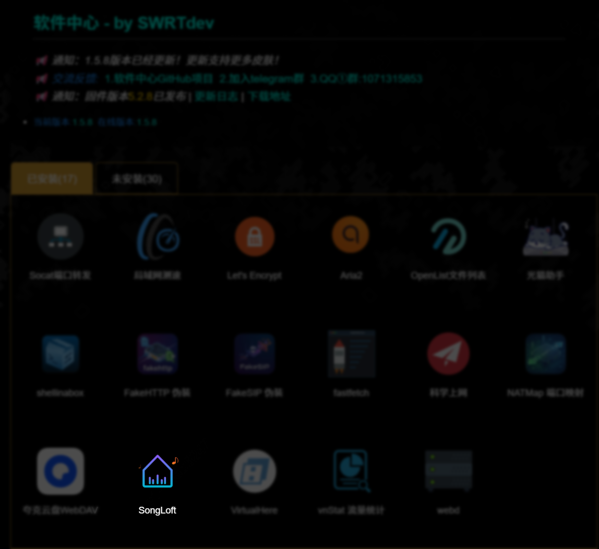
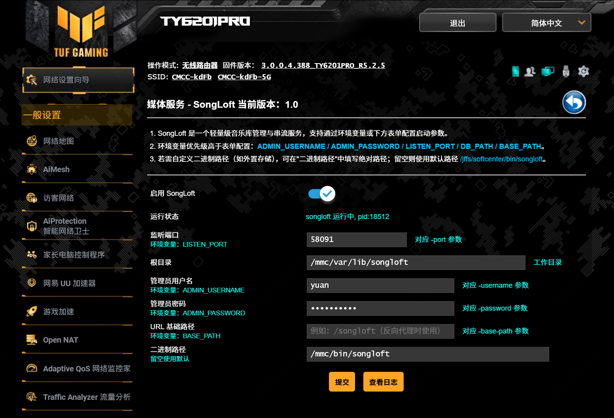
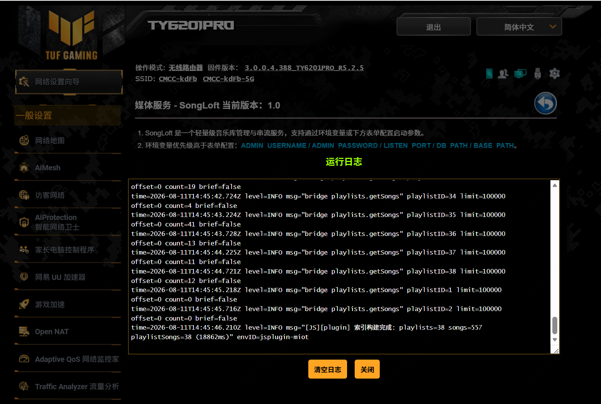

# SongLoft - 梅林（Merlin）离线安装包

适用于 [SWRTdev 软件中心](https://github.com/SWRTdev) 与 [Koolshare 软件中心](https://github.com/koolshare) 两种梅林第三方固件的 SongLoft 离线安装包，让你在梅林路由器上一键运行 [SongLoft](https://github.com/songloft-org/songloft) 轻量级音乐库管理与串流服务。

> **梅林版插件包内不含 SongLoft 服务端二进制文件**（`bin/` 目录为空），需要自行前往 [songloft-org/songloft Releases](https://github.com/songloft-org/songloft/releases) 下载对应路由器 CPU 架构（如 `arm`、`arm64`、`mips` 等）的最新版本二进制文件。发布包中会同时提供 **完整版（含内置 Web UI）** 与 **lite 版（不含 Web UI，体积更小）**，可根据自己的需求自由选用其一。下载后将二进制文件重命名为 `songloft` 并上传到路由器，再通过管理页面的"二进制路径"配置项指向该文件即可（详见下方[配置说明](#配置说明)）。
>
> 若使用 OpenWrt / Entware 版本，则无需手动下载二进制文件，安装时会自动从 [songloft-org/songloft](https://github.com/songloft-org/songloft) 及 [songloft-org/songloft-player](https://github.com/songloft-org/songloft-player) 拉取对应版本源码与前端资源进行构建，详见根目录 [`entware/songloft/Makefile`](../../entware/songloft/Makefile) 与 [`openwrt/songloft/Makefile`](../../openwrt/songloft/Makefile) 的构建流程。

## 目录结构

- `merlin/songloft-SWRT`：适用于 SWRTdev（水星/华硕梅林第三方固件）软件中心的安装包
- `merlin/songloft-koolshare`：适用于 Koolshare 软件中心的安装包

两个安装包功能与配置项完全一致，仅安装路径不同（`SWRT` 版安装到 `/jffs/softcenter`，`koolshare` 版安装到 `/koolshare`），请根据自己路由器所刷固件类型选择对应安装包。

## 安装方式

1. 根据固件类型下载对应的安装包（`songloft-SWRT` 或 `songloft-koolshare` 目录，或对应打包后的压缩包）。
2. 打开路由器管理后台的 **软件中心**，通过"本地上传/离线安装"方式上传安装包，等待安装完成。
3. 安装完成后，软件中心插件列表中会出现 **SongLoft** 图标，点击进入即可管理。

## 配置说明

进入 SongLoft 管理页面后，可以看到以下配置项：

| 页面字段 | 对应环境变量 | 说明 |
| --- | --- | --- |
| 启用 SongLoft | - | 开启/关闭插件，关闭后会自动停止进程 |
| 监听端口 | `LISTEN_PORT` | 对应 `-port` 参数，默认 `58091` |
| 根目录 | `DB_PATH` | 数据/工作目录，默认 `/jffs/softcenter/songloft`（koolshare 版为 `/koolshare/songloft`） |
| 管理员用户名 | `ADMIN_USERNAME` | 对应 `-username` 参数，留空则不设置 |
| 管理员密码 | `ADMIN_PASSWORD` | 对应 `-password` 参数，留空则不设置 |
| URL 基础路径 | `BASE_PATH` | 对应 `-base-path` 参数，用于反向代理场景，例如 `/songloft` |
| 二进制路径 | - | SongLoft 可执行文件路径，**必须手动指定**为自行下载的二进制文件所在路径（如放置在外置存储上）；留空则使用默认路径 `/jffs/softcenter/bin/songloft`，但由于插件包内不含二进制文件，需自行将下载好的文件放置到该默认路径下 |

> 环境变量优先级高于表单配置：`ADMIN_USERNAME` / `ADMIN_PASSWORD` / `LISTEN_PORT` / `DB_PATH` / `BASE_PATH`。

配置完成后点击"提交"即可生效，页面会实时显示运行状态（进程 PID），并支持点击"查看日志"弹窗实时查看运行日志。

## 卸载

在软件中心的插件管理中直接卸载即可，卸载脚本会自动停止服务、清理相关文件及 dbus 配置项，但不会删除已生成的音乐库数据目录（`根目录` 配置项指向的路径），如需彻底清理请手动删除。

## 常见问题

- **修改配置后不生效？** 请确认页面显示的"运行状态"是否已刷新为最新 PID，若长时间未变化可尝试重新点击"提交"或查看运行日志排查报错。
- **希望把数据放到外置硬盘？** 将"根目录"和"二进制路径"分别指向外置存储上的目录/文件即可。
